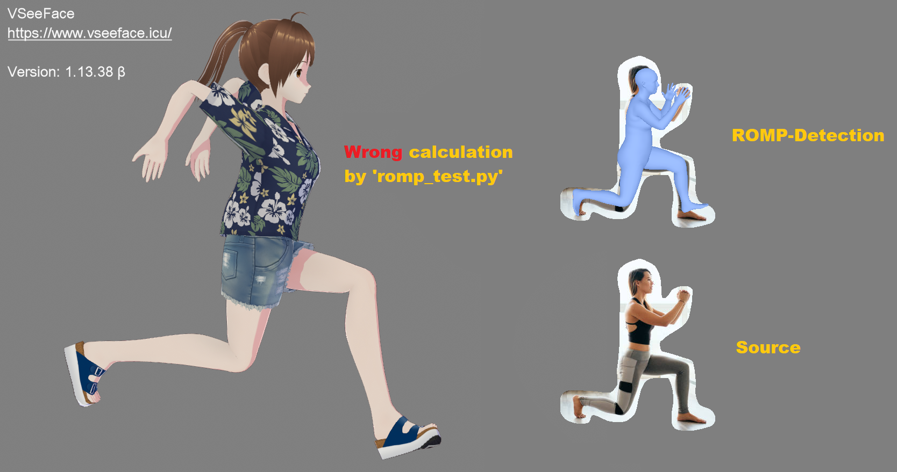

# Virtual Motion Capture protocol package for Python

WARNING: This package is still a draft, but working now ;)

## Testing
Using [`romp_test.py`](https://github.com/vivi90/python-vmc/blob/main/vmc/romp_test.py).

Note: Your receiving application might require [at least 3 sending attempts at the beginning, because of movement smoothing](https://github.com/emilianavt/VSeeFaceReleases/issues/15#issuecomment-1164759944).

## Project state meanings
 * **Unstable:** Still an *possibly* broken draft or breaking issues are known.
 * **Refactoring:** Structural and technical changes have currently priority.
 * **Stable:** Everything seems working as expected.
 * **Fixes only:** The project is maintained at the minimum level to apply at least fixes.
 * **Takeover:** The project is currently being taked over by another team and will possibly move.
 * **Not maintained:** The project is not maintained any more (ready to take over).

*Feature requests are welcomed all the time, of course! ;-)*

## License
This project is free under the terms of the AGPL 3.0 (or later) license. 
For more details please see the LICENSE file or: [GNU](https://www.gnu.org/licenses/agpl.html)
